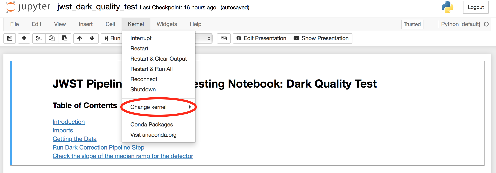

# JWST Validation Notebooks

This repository contains notebook that are used to validate the output of the JWST Calibration Pipeline. These notebooks are structured to capture documentation, code and figures and other outputs that will need to be inspected by eye by members of the JWST instrument teams.

These notebooks follow a consistent [style guide](https://github.com/spacetelescope/style-guides/blob/master/guides/jupyter-notebooks.md) in terms of layout/structure, coding conventions etc.

## Contents

This repository holds the notebooks themselves, but in a harder-to-read unexecuted form. If you want to view the notebooks online, you should view [the rendered versions](https://spacetelescope.github.io/jwst_validation_notebooks/).  At present this includes:

* CALDETECTOR 1
    * [Linearity Correction Residuals](https://spacetelescope.github.io/jwst_validation_notebooks/jwst_validation_notebooks/jwst_linearity_residuals_test/jwst_linearity_validation_testing.html)
    * [Dark Correction Quality](https://spacetelescope.github.io/jwst_validation_notebooks/jwst_validation_notebooks/jwst_dark_quality_test/jwst_dark_quality_test.html)

## Executing Notebooks Locally

### Installing the JWST Calibration Pipeline ###
To execute the notebooks locally, you must install the JWST Pipeline using [conda](https://conda.io/docs/index.html):

    conda create -n jwst --file <URL>
    source activate jwst

where `<URL>` is of the form:

    Linux: http://ssb.stsci.edu/releases/jwstdp/0.12.2/latest-linux
    OS X: http://ssb.stsci.edu/releases/jwstdp/0.12.2/latest-osx

### CRDS Setup ###

Inside the STScI network, the pipeline works with default CRDS setup with no modifications.  To run the pipeline outside the STScI network, CRDS must be configured by setting two environment variables:

    export CRDS_PATH=$HOME/crds_cache
    export CRDS_SERVER_URL=https://jwst-crds.stsci.edu

### Setting up Notebook Kernel ###

To activate and use your JWST conda environment in the notebook setting you will need to install `nb_conda` and `ipykernel`

    conda install nb_conda
    conda install ipykernel

Later, we will show how to change between the different kernels.

### Getting the Notebooks ###

Clone the repository:

    git clone https://github.com/spacetelescope/jwst_validation_notebooks.git
    cd jwst_validation_notebooks

### Opening and Running Notebooks ###

To start the jupyter enter:

    jupyter notebook

This will open the your web browser, here you can access the notebooks by selecting the `jwst_validation_notebooks` folder

from here you can select the specific testing directory and notebook. Jupyter Notebooks have extension `.ipynb`.

### Selecting Kernel ###

To change the kernel, use the Kernel drop down in the top left corner of the notebook and hover over "Change Kernel".

From here, you can select the conda environment kernel that has the JWST pipeline installed.

### Running Notebooks ###

Now that you have the notebook of your choice open with the proper kernel selected, you will want to execute the cells to perform your own tests. 
For commands on how to execute the cells look at the [Jupyter Notebook](https://jupyter-notebook.readthedocs.io/en/stable/) documentaion.
Here is a useful [cheat sheet](https://www.cheatography.com/weidadeyue/cheat-sheets/jupyter-notebook/pdf_bw/) with shortcuts and commands. 